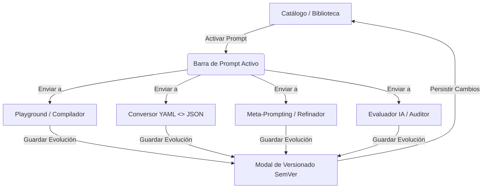

# Manual de Usuario: PromptVault

**Autor: Gabriel Sessa &mdash; Licencia GNU GPL v3**

Este manual describe el funcionamiento, la arquitectura y el flujo operativo de **PromptVault**, plataforma de gestión inteligente de bibliotecas de prompts, desarrollada bajo la licencia libre **GNU GPL v3** por **Gabriel Sessa (2026)**.

---

## 🛠️ 1. Arquitectura y Modos de Ejecución

La plataforma utiliza una **arquitectura híbrida de persistencia** diseñada para ser resiliente y no requerir instalaciones complejas:

### A. Modo Conectado (SQLite)
*   **Requisito**: Ejecutar en consola el servidor local: `python server.py`.
*   **Persistencia**: Los datos se almacenan en una base de datos relacional SQLite local (`prompts.db`). La base de datos utiliza una clave primaria compuesta **`(id, version)`**, lo que garantiza que coexistan múltiples versiones e historiales de un mismo prompt en lugar de ser sobreescritos.
*   **Sincronización**: Las operaciones de creación, edición, versión y eliminación de prompts se sincronizan en tiempo real mediante API REST. El indicador en la cabecera mostrará **"Conectado a SQLite Local"** en color verde.

### B. Modo Local (localStorage Fallback)
*   **Requisito**: Abrir el archivo `index.html` directamente en el navegador sin levantar el servidor.
*   **Persistencia**: Los datos se guardan en el `localStorage` del navegador.
*   **Sincronización**: Permite al alumno trabajar de forma independiente. Si el servidor se enciende posteriormente, la página puede recargarse para migrar los datos. El indicador en la cabecera mostrará **"Offline - Almacenamiento Local"** en color amarillo.

---

## 🖥️ 2. Guía Detallada de Módulos e Interfaz

La aplicación se compone de siete módulos principales accesibles desde la barra de navegación lateral:



---

### 📂 Módulo 1: Biblioteca Semilla (Catálogo)
Es el repositorio principal de plantillas de prompts de la organización. Soporta la **coexistencia de múltiples versiones de un mismo prompt** en el catálogo general, facilitando un historial de versiones auditable e independiente.

1.  **Explorador del Catálogo**: Muestra todas las versiones registradas de los prompts en la base de datos con su nombre, versión, ruta taxonómica, variables inyectables y estado actual como entradas independientes. Esto permite revertir, auditar o alternar el uso de diferentes versiones.
2.  **Buscador en Tiempo Real**: Permite filtrar al instante escribiendo texto (busca coincidencias en nombre, descripción, taxonomía, variables y el texto del prompt).
3.  **Filtro de Estados**: Dropdown para aislar rápidamente prompts según su fase operativa:
    *   `En Producción` (Badge Verde): Validado y seguro para uso general.
    *   `En Revisión` (Badge Amarillo): En etapa de pruebas.
    *   `Borrador` (Badge Gris): Versión preliminar.
    *   `Deprecado` (Badge Rojo): Obsoleto, no se aconseja su uso.
4.  **Filtro por Etiquetas**: El sistema extrae dinámicamente todos los `tags` y genera botones. Al hacer clic en un tag, se reduce la lista de prompts a aquellos asociados a dicha etiqueta.
5.  **Creación de Prompts**: El botón "Crear Nuevo Prompt" despliega un formulario para registrar una nueva plantilla (nombre, ID único en minúsculas, taxonomía, modelos compatibles, variables, RAG, estado y plantilla).
6.  **Ficha Detallada (Modal)**: Al hacer clic en cualquier versión de un prompt, se abre un modal de lectura con sus metadatos completos y las opciones de:
    *   **Activar en Ciclo de Vida**: Coloca la versión seleccionada del prompt en la cabecera global para trabajar con ella en otras pestañas.
    *   **Cargar en el Compilador**: Lo inyecta directo en el Playground.
    *   **Editar**: Abre el modal de edición para modificar los metadatos, instrucción o cambiar el estado de gobernanza de **esta versión específica**.
    *   **Eliminar**: Borra de forma física la versión seleccionada del prompt de la base de datos (SQLite / LocalStorage) sin afectar a las otras versiones del mismo ID.

---

### ⚡ Módulo 2: Compilador de Plantillas (Playground)
Permite probar las plantillas inyectando valores reales en sus placeholders.

1.  **Placeholders Dinámicos**: El playground escanea el texto del prompt mediante expresiones regulares buscando variables encerradas en llaves (ej: `{canales}`).
2.  **Generación de Formulario**: Por cada variable encontrada, dibuja un input en la columna derecha para que el usuario escriba su valor.
3.  **Compilación en Tiempo Real**: A medida que el usuario escribe, el texto del prompt en la caja inferior de vista previa se reemplaza dinámicamente.
4.  **Acciones**: Botón de copiado rápido al portapapeles de la instrucción final renderizada.

---

### 🔄 Módulo 3: Conversor YAML / JSON
Facilita la conversión del doble formato (legible por humanos frente a legible por máquinas).

1.  **Carga del Catálogo**: Permite seleccionar una versión específica de cualquier prompt de la base de datos (SQLite / LocalStorage) a través de un menú desplegable, cargando y construyendo automáticamente su representación en formato YAML-Markdown en el panel de entrada.
2.  **Entrada de Markdown**: Caja izquierda donde se escribe o se carga la estructura estructurada con cabecera YAML Frontmatter (entre líneas `---`) y el prompt abajo.
3.  **Conversión Automática**: Al seleccionar un prompt o presionar "Compilar a JSON", un parser en JavaScript lee las líneas clave-valor del Frontmatter y genera de manera inmediata la estructura JSON compilada en la caja derecha, lista para ser copiada y consumida por APIs.

---

### 🔄 Módulo 4: Ejercicios Prácticos
Panel interactivo para que los estudiantes respondan las 5 autoevaluaciones del curso:

*   **Ejercicio 1 (Taxonomía)**: Clasificación de metadatos del NDA (Ruta, RAG, Variables).
*   **Ejercicio 2 (Formatos)**: Escritura de estructura JSON sintácticamente correcta.
*   **Ejercicio 3 (Variables)**: Estandarización de placeholders en mayúsculas.
*   **Ejercicio 4 (Meta-Prompting)**: Diseño de orquestador de expertos con debate.
*   **Ejercicio 5 (Gobernanza)**: Elección de incremento SemVer ante cambios de variables.
*   **Validación**: Cada pestaña cuenta con un botón "Validar Solución" que ejecuta pruebas lógicas y da feedback inmediato (verde/éxito o rojo/errores a corregir).

---

### 🧠 Módulo 5: Asistente Meta-Prompt
Generador automatizado de plantillas de prompts de nivel de sistema basados en la técnica de Auto-meta Prompting.

1.  **Parámetros**: El usuario ingresa la tarea, el rol del experto, las variables de entrada del prompt final y el formato de salida deseado.
2.  **Generación**: Compone automáticamente un meta-prompt de nivel élite que puede ser enviado a un LLM comercial para que este diseñe de forma precisa el prompt final ideal.

---

### 🤖 Módulo 6: Evaluador IA (Auditoría de Prompts)
Conecta la aplicación web con APIs de Inteligencia Artificial para auditar y optimizar prompts orgánicamente en tu flujo de trabajo.

#### A. Configuración de Proveedores
*   **Google Gemini**: Requiere ingresar la API Key y seleccionar el modelo (por defecto, `gemini-1.5-flash`). La llamada utiliza el endpoint oficial de Google.
*   **OpenAI**: Requiere ingresar la API Key de desarrollador y elegir modelo (`gpt-4o-mini` o `gpt-4o`).
*   **Ollama (Local)**:
    *   URL por defecto: `http://localhost:11434`.
    *   **🔄 Cargar**: Al hacer clic, lee la base de Ollama y despliega en un menú de selección todos los modelos instalados en tu computadora (ej: `llama3`, `mistral`, `gemma`).
    *   > [!IMPORTANT]
        > Para evitar bloqueos de seguridad del navegador (CORS), Ollama debe levantarse permitiendo orígenes externos. En la consola de comandos de Windows ejecuta:
        > `cmd /c "set OLLAMA_ORIGINS=* && ollama serve"`

#### B. Flujo de Auditoría
1.  Escribe un prompt o cárgalo directamente desde el catálogo.
2.  El **System Prompt de la IA Experta** viene predefinido con criterios del taller (XML, Chain of Thought, evitación de alucinaciones, etc.) y es 100% editable.
3.  Presiona **"Evaluar con IA"**.
4.  **Resultados Divididos**:
    *   **Diagnóstico Crítico**: Muestra los aciertos y fallos de la instrucción original analizados por el evaluador.
    *   **Prompt Optimizado**: Muestra la instrucción reestructurada y corregida.
5.  **Acciones Cruzadas**:
    *   **Probar en Playground**: Envía el prompt optimizado a la pestaña del playground de placeholders.
    *   **Evolucionar Versión**: Abre el modal SemVer para guardar el prompt optimizado como una nueva versión en tu base de datos SQLite / localStorage. Al hacer clic, se auto-activa el prompt original evaluado (si no estaba activo en el catálogo global) y se pre-selecciona automáticamente la opción de fuente "Prompt Optimizado por IA (Evaluador IA)" para agilizar el proceso.

---

### ❓ Módulo 7: Asistente & FAQ (Glosario y Ayuda)
Soporte pedagógico integrado para alumnos.

1.  **Asistente del Sistema Experto**: Un selector interactivo que explica detalladamente la importancia de cada campo del sistema (Ruta taxonómica, RAG, JSON, Changelog, CORS de Ollama, Licencia GPL v3, etc.), indicando qué tipo de datos colocar y ejemplos de resolución.
2.  **Guía Avanzada SemVer**: Grilla estructurada detallando las reglas de evolución (Parche, Menor, Mayor) para prompts.
3.  **Preguntas Frecuentes (FAQ)**: Acordeones interactivos que resuelven dudas teóricas y técnicas del taller.

---

## 📈 3. Flujo Completo del Ciclo de Vida del Prompt (Ejemplo de Uso)

Para exprimir al máximo el dashboard, sigue este flujo de desarrollo:

```
[Catálogo] -> [Activar] -> [Evaluador IA] -> [Optimizar] -> [Playground] -> [Evolucionar] -> [Catálogo]
```

1.  **Creación**: Diseña una instrucción básica en el Catálogo (ej: `v1.0.0` estado `Borrador`).
2.  **Activación**: Entra en el prompt y presiona **"Activar en Ciclo de Vida"**. Verás la barra superior activarse.
3.  **Auditoría**: Ve a la pestaña **Evaluador IA**, carga tu prompt y presiona **"Evaluar con IA"**. Revisa el **Diagnóstico Crítico**.
4.  **Optimización**: Ve a la pestaña **Prompt Optimizado** y presiona **"Probar en Playground"** para ver las variables del nuevo prompt inyectadas de forma interactiva.
5.  **Gobernanza**: En la barra superior de prompt activo (o desde el botón "Evolucionar Versión" del Evaluador IA), presiona el botón para abrir el asistente de evolución.
    *   Selecciona el incremento de versión (ej: **Menor** si agregaste nuevas variables, avanzando a `v1.1.0`).
    *   Escribe el **Changelog** (ej: "Optimizado con la propuesta de IA experta, estructurando con etiquetas XML").
    *   Selecciona la fuente: **"Prompt Optimizado por IA (Evaluador IA)"** (se pre-selecciona si vienes de la pestaña del evaluador).
    *   Cambia el estado a **"En Producción"** o **"En Revisión"** según si estará en pruebas o se pasará a producción.
    *   Presiona **"Evolucionar y Guardar"**.
6.  **Catálogo Actualizado**: Tu catálogo ahora cuenta con el prompt en su última versión `v1.1.0` en estado de producción listo para el equipo.

---

## 📄 4. Licencia y Atribución

Este software es propiedad intelectual y autoría de **Gabriel Sessa (2026)**.

Está protegido bajo la **GNU General Public License versión 3 (GPL v3)**. Esto significa que la herramienta es y seguirá siendo siempre libre y gratuita. Puedes usarla, modificarla y distribuirla de forma ilimitada con la única condición de que cualquier versión derivada que compartas sea también libre y de código abierto bajo esta misma licencia.

*   **Email**: [gabriel.linux.ar@gmail.com](mailto:gabriel.linux.ar@gmail.com)
*   **GitHub**: [github.com/redhard10](https://github.com/redhard10)
*   **LinkedIn**: [linkedin.com/in/gabrielsessa](https://linkedin.com/in/gabrielsessa)
